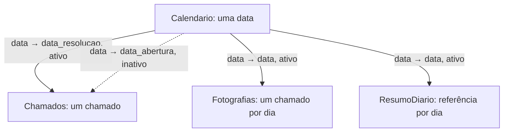

# Modelo de leitura para Power BI

## O que está pronto

Quatro views privadas criadas no Supabase e quatro CSVs locais preparados. Nove verificações SQL passaram; os arquivos locais passaram pela conferência de chaves, cobertura de datas e leitura após gravação. Atualização em 12/09/2026: importação local, relacionamentos e páginas Duração/Fila foram realizados manualmente no Desktop. Veja [medidas, conferências e pendências de entrega](relatorio-power-bi.md). O PBIX está salvo na pasta power_bi; as nove fórmulas foram conferidas no PBIP, que contém os ajustes mais recentes do modelo.

| Power BI / arquivo CSV | View em analytics | Grão | Linhas atuais |
|---|---|---|---:|
| Calendario | bi_calendario | Uma data | 731 |
| Chamados | bi_chamados | Um chamado | 24.918 |
| Fotografias | bi_fotografias | Um chamado por data | 170.645 |
| ResumoDiario | bi_resumo_diario | Uma data observada | 355 |

As views usam as tabelas já reconciliadas. Os CSVs vêm do modelo Python local, também reconciliado com o banco na etapa de carga. Esta etapa não baixou os dados pelo Python autenticado. A migração está em `sql/06_modelo_power_bi.sql`; as verificações estão em `sql/07_validar_modelo_power_bi.sql` e a evidência em `docs/modelo-power-bi-validacao.json`.

## Por que dois tipos de fatos

Em Chamados, um incidente aparece uma vez e guarda seus atributos finais. Essa tabela responde quanto durou um chamado resolvido em determinada data. Em Fotografias, o mesmo incidente pode aparecer em muitos dias, guardando o último estado observado até cada corte. Essa tabela responde como estava a fila naquele dia.

Não crie relacionamento entre Chamados e Fotografias pelo campo `number`. Isso permitiria que filtros de atributos finais selecionassem a fila histórica, misturando momentos diferentes. Os eventos detalhados permanecem no banco para investigação, sem importação nesta primeira versão.



Configure todos como **um para muitos (1:*)**, com filtro **único do Calendario para a outra tabela**. Mesmo com uma linha por data no ResumoDiario, escolha 1:* explicitamente para manter a direção única; evite a configuração automática 1:1 com filtro em ambos os sentidos.

| Coluna do lado 1 | Coluna do lado muitos | Estado |
|---|---|---|
| Calendario[data] | Chamados[data_resolucao] | Ativo |
| Calendario[data] | Chamados[data_abertura] | Inativo |
| Calendario[data] | Fotografias[data] | Ativo |
| Calendario[data] | ResumoDiario[data] | Ativo |

A relação inativa fica reservada para futuras medidas por abertura com `USERELATIONSHIP`. Nesta etapa, seleção de mês significa **mês de resolução** nos indicadores de duração e **mês das fotografias** nos indicadores da fila. Identifique isso nos títulos dos visuais. Se precisarmos selecionar abertura e resolução independentemente, criaremos calendários por papel; não há essa necessidade agora.

## Calendário e ausência de dados

O calendário abrange anos completos, de 01/01/2016 a 31/12/2017. Ele é gerado pelos limites das datas de abertura, resolução e calendário de fotografias. Os relacionamentos usam colunas do tipo **Data**, sem hora; os timestamps originais continuam disponíveis para cálculos e auditoria.

A coluna `data_fotografia_elegivel` é verdadeira apenas nos 355 dias de 29/02/2016 a 17/02/2017. Fora desse domínio, ausência de linhas significa falta de cobertura, não fila zero. A flag não deve ser um filtro global da página de duração: isso confundiria a cobertura das duas análises.

Dentro do domínio observado, 14/02/2017 e 17/02/2017 têm fila zero. Para cartões de fila em um período, a medida usa a última **data elegível selecionada**, inclusive se vazia. Se nenhuma data selecionada for elegível, retornar em branco. Não buscar a última data com pendentes, somar estoques diários ou tirar média das medianas.

Os 1.556 chamados sem resolução informada permanecem em Chamados com `data_resolucao` nula. Ao filtrar um período pela relação ativa, eles saem daquele recorte. O cartão de qualidade global deverá ignorar explicitamente o filtro de data e ser identificado como referente à extração inteira.

## Importação local, sem senha

1. Na raiz do repositório, execute o script abaixo. Os CSVs e o parâmetro local ficam fora do Git; as consultas M são versionadas.

   ```powershell
   .\.venv\Scripts\python.exe scripts/11_preparar_power_bi.py
   ```

2. Abra um relatório em branco no Power BI Desktop e entre em **Transformar dados**. No Power Query, crie uma **Consulta nula/em branco**. No **Editor Avançado**, substitua o conteúdo pelo arquivo `data/processed/power_bi/PastaDados.pq`. Nomeie a consulta **PastaDados**. Esse parâmetro contém o caminho absoluto desta máquina, com a barra final; não deve virar tabela carregada.
3. Crie mais quatro consultas em branco. Cole no Editor Avançado o conteúdo dos arquivos de `power_bi/power_query/`, com os nomes exatos **Calendario**, **Chamados**, **Fotografias** e **ResumoDiario**.
4. Confira a prévia e os tipos; depois **Fechar e Aplicar**. As consultas declaram datas, timestamps, inteiros, decimais, booleanos e textos. Usam `en-US` para ler o ponto decimal do CSV; a apresentação do relatório pode continuar em português. Campos vazios viram `null` antes da conversão.
5. Na exibição de modelo, revise/remova relacionamentos detectados automaticamente e crie somente os quatro da tabela acima. Desative **Data/hora automática** para este arquivo nas opções de carregamento de dados. Selecione Calendario e **Marcar como tabela de datas**, usando `data`.
6. Configure identificadores (`number`, `linha_csv`, `linha_csv_final`) como **Não resumir**. Oculte campos técnicos dos usuários do relatório, mantendo-os no modelo. Use `Calendario[ano_mes]` nos eixos mensais; o formato YYYY-MM já ordena cronologicamente.
7. Salve em `power_bi/support-operations-analytics.pbix`. Confira erros de carregamento e as contagens da tabela inicial antes de criar medidas.

Os textos M foram gerados e revisados na preparação; a importação manual no Power BI foi concluída posteriormente, conforme o registro do relatório. Caso uma conversão falhe, investigar o valor original, sem substituir silenciosamente por zero.

## Cuidados com os primeiros visuais

- Mediana e P90 de duração serão medidas sobre `Chamados[duracao_resolucao_horas]`, com elegibilidade explícita; não agregar percentis de grupos.
- Fila conta apenas `classe_estado = "pendente"`; desconhecidos são separados. Mediana da idade usa `idade_valida`.
- Recortes de prioridade/grupo em Chamados são finais; em Fotografias são do estado observado naquele corte. Um filtro em uma dessas tabelas não deve aparentar filtrar a outra.
- ResumoDiario serve para conferir totais por data. Não responde a filtros de prioridade ou grupo, pois não possui esse detalhamento; não usar seu total como denominador de um segmento.
- A flag temporal é uma avaliação retrospectiva da qualidade da extração. Os dados não trazem metas de SLA nem garantem histórico operacional completo.

## Conexão futura e segurança

As quatro views usam `security_invoker=true`, preservando as permissões do usuário que consulta. O esquema analytics continua privado; não foram criadas credenciais nem permissões de leitura pública. Uma conexão direta do Power BI precisará de autenticação e de um papel de leitura adequado, em etapa própria. A existência da view não equivale à conexão do Power BI.

O verificador do Supabase retornou cinco avisos informativos de RLS sem política nas tabelas existentes. Isso é intencional nesta fase de acesso administrativo; não houve aviso de segurança nas novas views. Consulte a [explicação do aviso](https://supabase.com/docs/guides/database/database-linter?lint=0008_rls_enabled_no_policy).

## Referências para estudar

- [Calendário no Power BI — Microsoft](https://learn.microsoft.com/en-us/power-bi/guidance/model-date-tables): datas únicas, contínuas e anos completos.
- [Relacionamentos ativos e inativos — Microsoft](https://learn.microsoft.com/en-us/power-bi/guidance/relationships-active-inactive): propagação de filtros e papéis de datas.
- [Esquema estrela — Microsoft](https://learn.microsoft.com/en-us/power-bi/guidance/star-schema): dimensões, fatos e grão.
- [Conversão explícita de tipos no Power Query — Microsoft](https://learn.microsoft.com/en-us/powerquery-m/table-transformcolumntypes): tipos e cultura de leitura.
- [Segurança de views — Supabase](https://supabase.com/docs/guides/database/postgres/row-level-security#views).

Exercício antes do próximo passo: um chamado aparece em dez fotografias. Contar as dez linhas significa dez chamados ou dez observações? Essa diferença determina quais medidas podem ser somadas no relatório.
